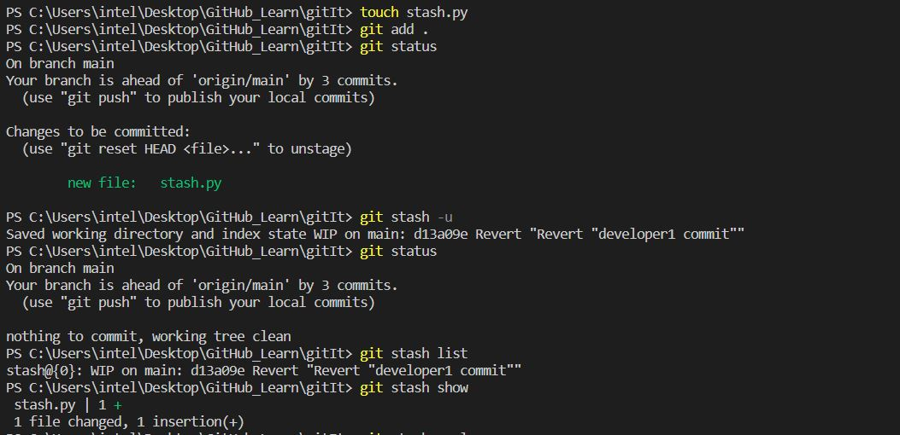

# Stash-Changes

Git stash- 
• Git stash is a built-in command with the distributed Version control tool in Git that locally stores all the most recent changes in a workspace and resets the state of the workspace to the prior commit state. 
• A user can retrieve all files put into the stash with the git stash pop and git stash apply commands. 

Sometimes you want to switch the branches, but you are working on an incomplete part of your current project. You don't want to make a commit of half-done work. Git stashing allows you to do so. The git stash command enables you to switch branches without committing the current branch. 

 
